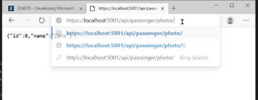
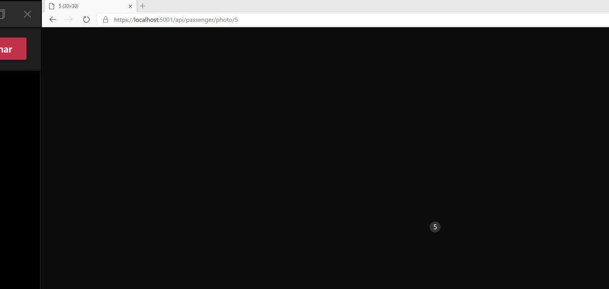

al buscar una foto

https://localhost:5001/api/passenger/photo/1

Nos devuleve el json con los datos:

Implementamos un formatter para que, en vez que devuelva el json, devuelva la imagen.

https://localhost:5001/api/passenger/photo/5

