# Module 5: Creating a Class Hierarchy by Using Inheritance

## Lesson 1: Creating Class Hierarchies

### Demonstration: Calling Base Class Constructors

#### Preparation Steps

1. Ensure that you have cloned the 20483C directory from GitHub. It contains the code segments for this course's labs and demos. (**https://github.com/MicrosoftLearning/20483-Programming-in-C-Sharp/tree/master/Allfiles**)
2. Navigate to **[Repository Root]\Allfiles\Mod05\Democode**, and then open the **BaseConstructors.sln** file.
3. If any security warning window appears, click **OK**.

#### Demonstration Steps

1. In **Solution Explorer**, double-click **Beverage.cs** and review the contents of the class.

   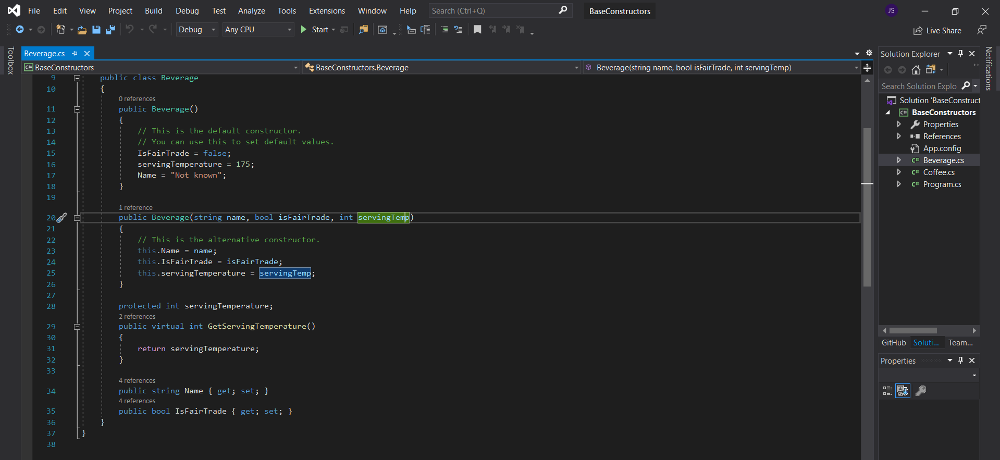

2. Note that the **Beverage** class contains a default constructor and an alternative constructor.

   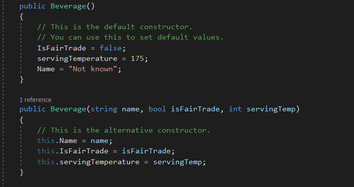

3. In **Solution Explorer**, double-click **Coffee.cs** and review the contents of the class.

   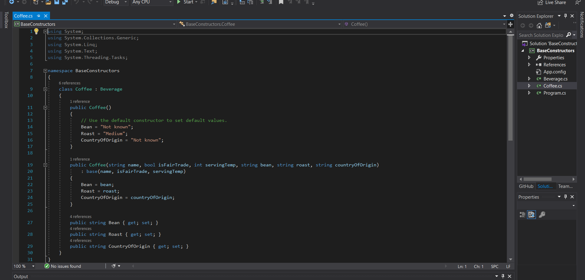

4. Note that the **Coffee** class inherits from the **Beverage** class.

   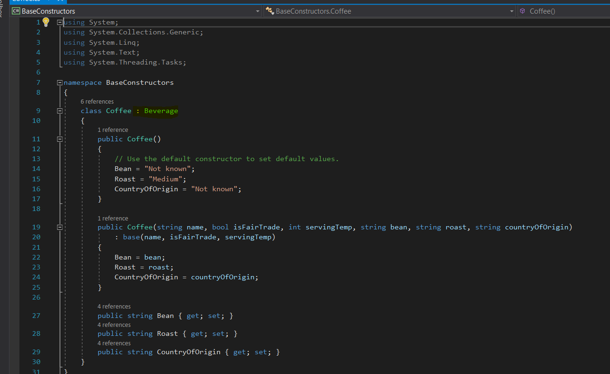

5. Note that the **Coffee** class contains a default constructor and an alternative constructor.

   

6. Note that the alternative constructor explicitly calls the alternative constructor in the base class.

7. In **Solution Explorer**, double-click **Program.cs** and review the contents of the class.

   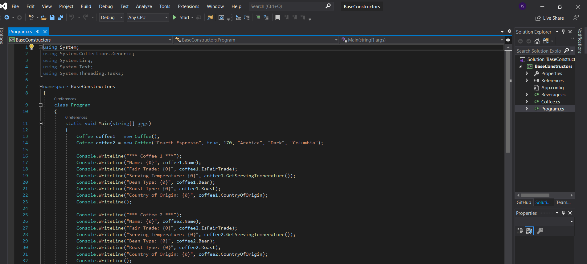

8. Note that the **Program** class creates two instances of the **Coffee** type: one by using the default constructor, and one by using the alternative constructor.

   

9. On the **Build** menu, click **Rebuild Solution**.

   

10. Press F11 twice so that the first line of executable code in the **Program** class is highlighted.

    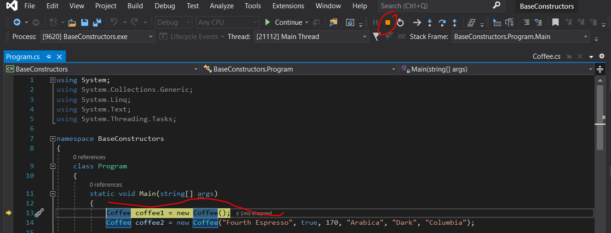

11. Press F11. Note that the debugger steps into the default constructor for the **Coffee** class.

    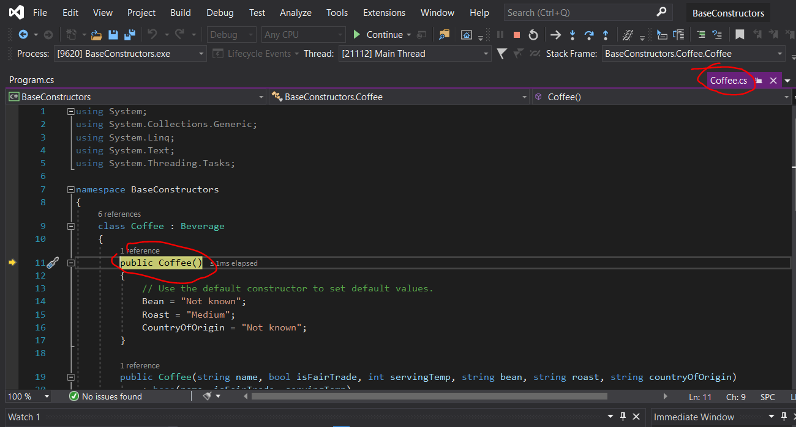

12. Press F11. Note that the debugger steps into the default constructor for the **Beverage** class.

    

13. Point out that derived class constructors implicitly call the default base class constructor unless you specify an alternative base class constructor.

    

14. Press F11 six times, until the debugger returns to the default constructor for the **Coffee** class.

    >**Note:** If  **Microsoft Visual Studio** windows appears, press **No** and continue with F11.

    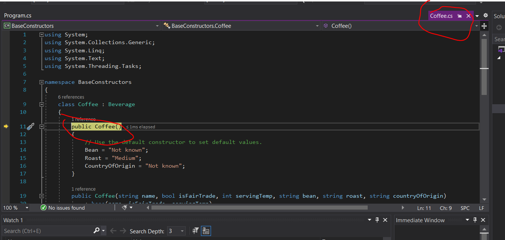

15. Point out that the base class constructor logic is run before the derived class constructor logic.

    

16. Press F11 six times, until the debugger returns to the **Program** class.

    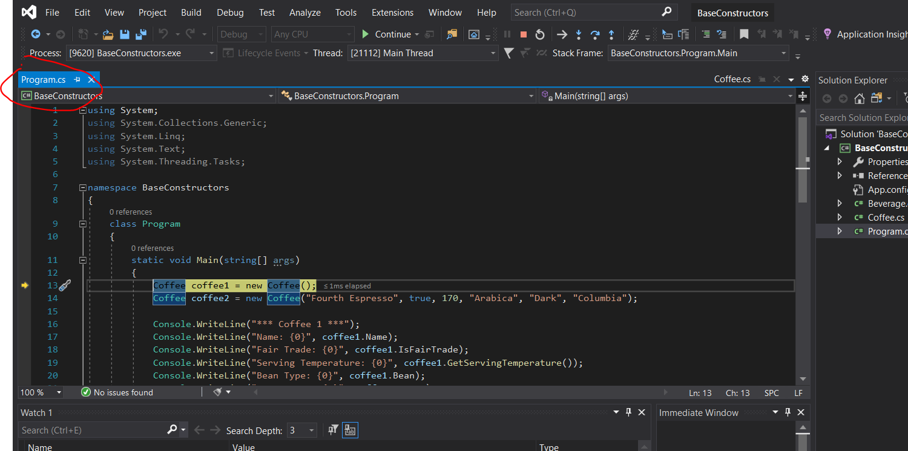

17. Press F11. The second executable line of code in the **Program** class is highlighted.

    

18. Press F11. Note that the debugger steps into the alternative constructor for the **Coffee** class.

    

19. Press F11. Note that the debugger steps into the alternative constructor for the **Beverage** class.

    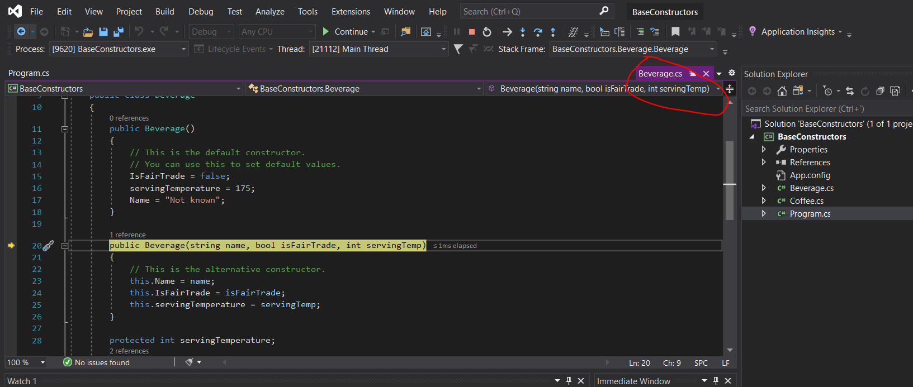

20. Place your mouse over the **Beverage** constructor parameters and point out that the **Coffee** constructor has passed argument values to this constructor.

    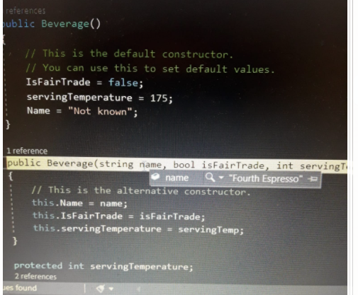

21. Press F11 six times, until the debugger returns to the alternative constructor for the **Coffee** class.

    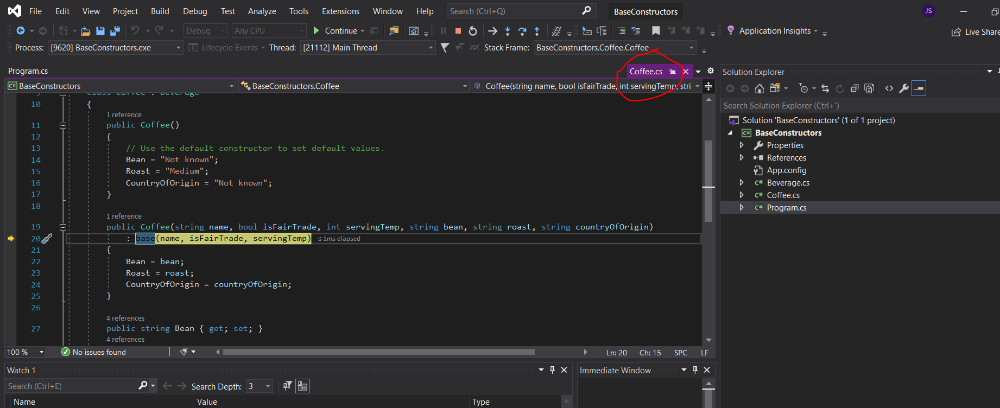

22. Press F11 six times, until the debugger returns to the **Program** class.

    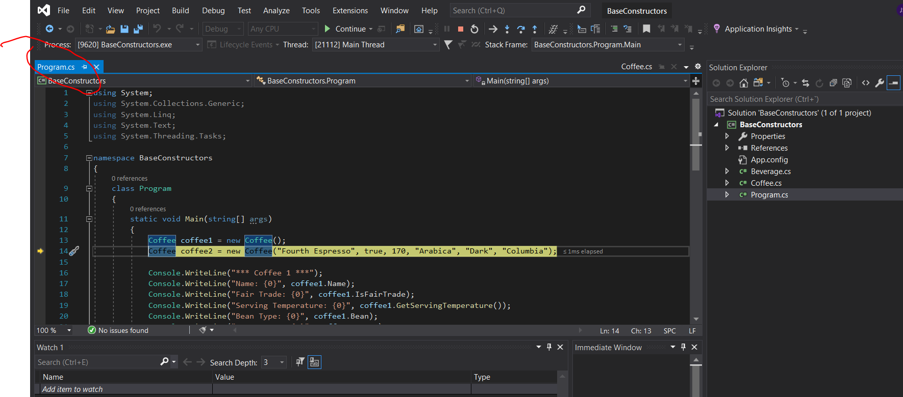

23. Press F5 to run the remainder of the application.

    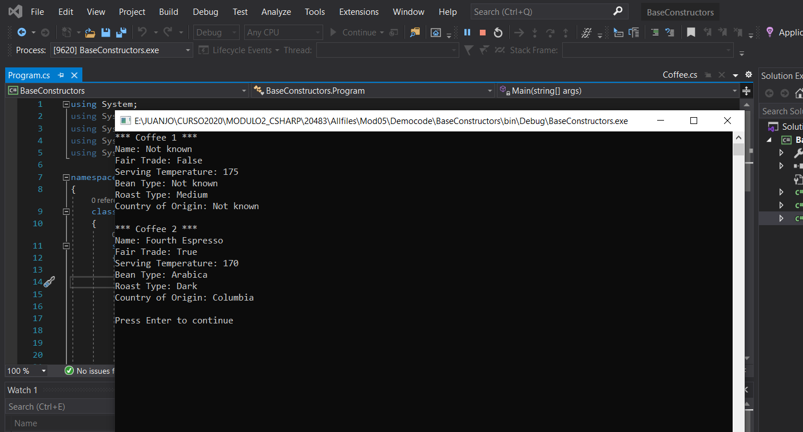

24. When the console window appears, point out that it makes no difference to consumers of the class whether variables were set by the derived class constructor or the base class constructor.

    

25. To close the console window, press Enter.

    

26. Close Visual Studio.

    

## Lesson 2: Extending .NET Framework Classes

### Demonstration: Refactoring Common Functionality into the User Class Lab

#### Preparation Steps

Ensure that you have cloned the 20483C directory from GitHub. It contains the code segments for this course's labs and demos. (**https://github.com/MicrosoftLearning/20483-Programming-in-C-Sharp/tree/master/Allfiles**)

#### Demonstration Steps

1. Open the **GradesPrototype.sln** solution from the **[Repository Root]\Allfiles\Mod05\Labfiles\Solution\Exercise 3** folder.
   
    >**Note :** If any Security warning dialog box appears, clear **Ask me for every project in this solution** check box and then click **OK**.
2. In the **Data** folder, open **Grade.cs**, and locate the **User** class.
3. Explain to the students that during Exercise 1 they will add this class and add the **UserName** and **Password** properties and the **VerifyPassword** method.
4. Locate the **Student** class and explain to the students that during Exercise 1 they will modify this class to inherit from the new **User** class and to use the member implementations that it provides.
5. Locate the **User** class again and explain to the students that during Exercise 2 they will add the abstract **SetPassword** method and use it from the set accessor of the **Password** property.
6. In the **Student** class, locate the **SetPassword** property and explain to the students that they will add code here to override the abstract property in the **User** class to ensure that student passwords are at least six characters long.
7. In the **Teacher** class, locate the **SetPassword** property and explain to the students that they will add code here to override the abstract property in the **User** class to ensure that teacher passwords contain at least two numeric characters and are at least eight characters long.
8. In the **Controls** folder, expand **ChangePasswordDialog.xaml**, open **ChangePasswordDialog.xaml.cs** and locate the **ok_Click** method
9. Explain to the students that during Exercise 2 they will add this code to call the appropriate implementation of the **SetPassword** method according to the role of the current user.
10. In the **Services** folder, open **ClassFullException.cs**.
11. Explain to the students that during Exercise 3 they will add **ClassName** property and custom constructors to this class.
12. In **Grade.cs**, locate the **Teacher** class and explain to the students that they will use the **MAX_CLASS_SIZE** constant to define the maximum number of students that may be enrolled in a class.
13. Locate the **EnrollInClass** method and explain to the students that during Exercise 3 they will add code here to throw the **ClassFullException** if the user attempts to add too many students to a class.
14. Run the application and log on as **vallee** with the password **password99**.
15. Point out that the application correctly displays the students in Esther Valle’s class.
16. Attempt to change the password to **password1** (a password that is not valid) and point out the error message that is displayed.
17. Change the password to **password101** (a valid password) and point out that the password is successfully changed.
18. Create four new students.
19. Try to enroll all four students in the class. When enrolling the fourth student, point out the error message that is displayed.
20. Log off, and then log on as **liuk** with the password **password**.
21. Point out that the application correctly displays the student’s grade report.
22. Attempt to change the password to **pass** (a password that is not valid) and point out the error message that is displayed.
23. Change the password to **passwd** (a valid password) and point out that the password is successfully changed.
24. Close the application, and then close Visual Studio.

©2018 Microsoft Corporation. All rights reserved.

The text in this document is available under the  [Creative Commons Attribution 3.0 License](https://creativecommons.org/licenses/by/3.0/legalcode), additional terms may apply. All other content contained in this document (including, without limitation, trademarks, logos, images, etc.) are  **not**  included within the Creative Commons license grant. This document does not provide you with any legal rights to any intellectual property in any Microsoft product. You may copy and use this document for your internal, reference purposes.

This document is provided &quot;as-is.&quot; Information and views expressed in this document, including URL and other Internet Web site references, may change without notice. You bear the risk of using it. Some examples are for illustration only and are fictitious. No real association is intended or inferred. Microsoft makes no warranties, express or implied, with respect to the information provided here.
