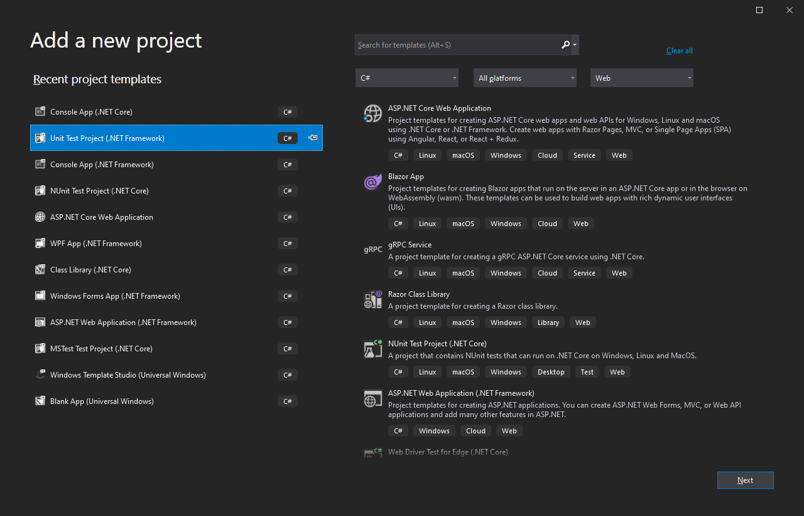
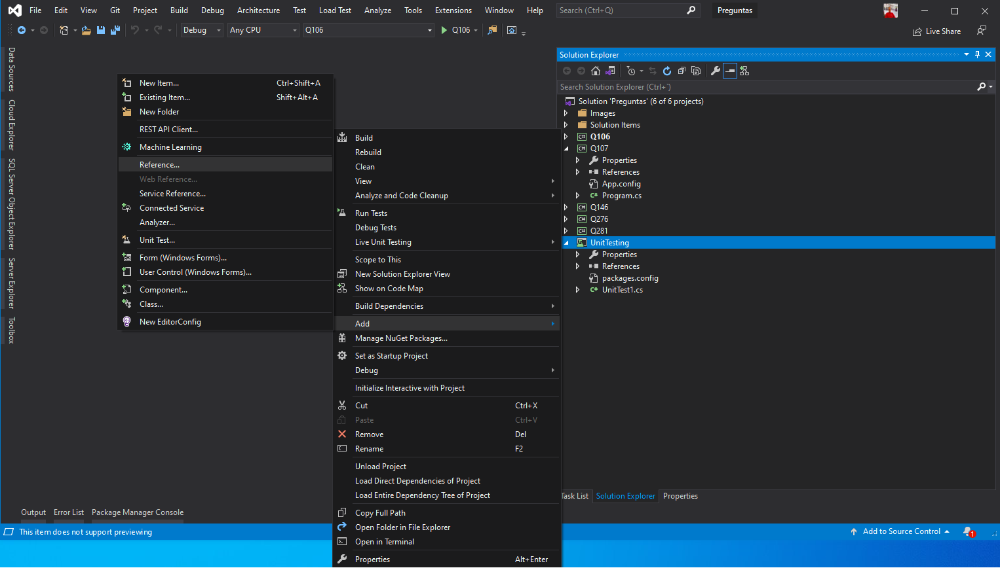
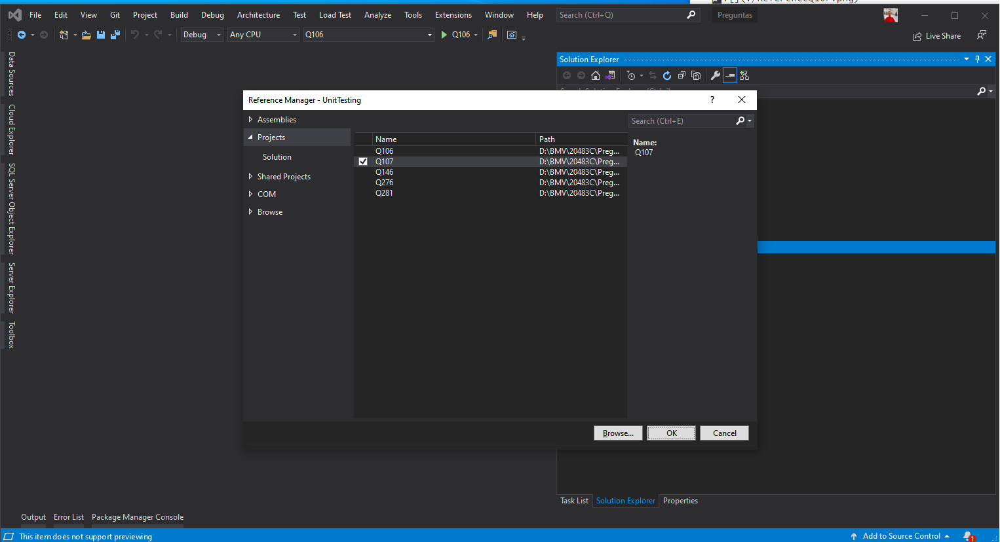
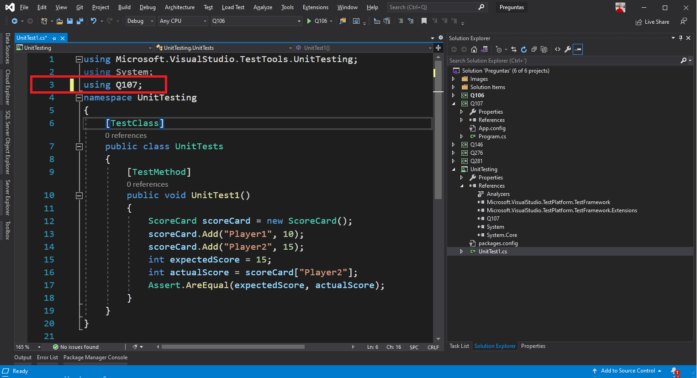
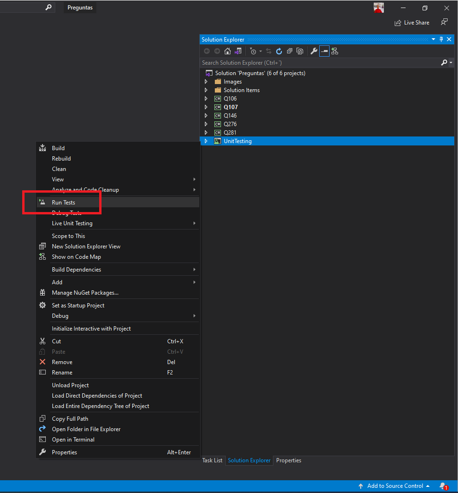
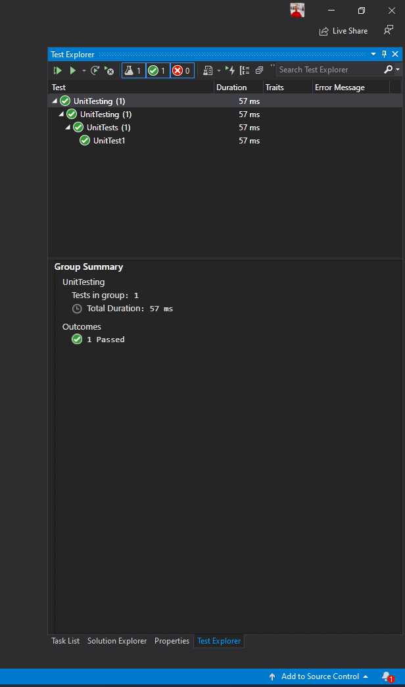

## Ejecutar la solución con los diferentes proyectos

Para ejecutar la solución se deberá poner cada proyecto como "Set as Startup Project", a excepción de **Q107** que se ejecuta con la prueba unitaria.


## Q106 Pregunta sobre certificados

Lo clave aqui, crear unos tres certificados con la herramienta **makecert** para hacer las distinciones entre los diferentes metodos de busqueda de certificados.

```powershell
 makecert -r -pe -n "CN=CERT_SIGN_TEST_CERT" -b 01/01/2020 -e 01/01/2022 -sky exchange -ss my
 makecert -r -pe -n "CN=CERT_SIGN_TEST2_CERT" -b 01/01/2020 -e 01/01/2022 -sky exchange -ss my
 makecert -r -pe -n "CN=CERT_SIGN_TEST3_CERT" -b 01/01/2020 -e 01/01/2022 -sky exchange -ss my
```


## Q107 Pregunta sobre Pruebas Unitarias en .NetFramework

Se debe crear un proyecto Unit Test Project (.Net Framework), para seguir las condiciones de la pregunta 107. 



Despues de crear el proyecto 107 (Que es donde va el código a probar de esta pregunta y según la pregunta), añadimos en el proyecto de UnitTest una referencia al proyecto 106 asi:





En el proyecto de UnitTest poner el using al proyecto Q107



**Para ejecutar la prueba**





## Q146 Pregunta sobre CodeDom (ERRATA)

Es necesario añadir una referencia desde NutGet a SystemCodeDom, para que el proyecto funcione, y también el proyecto de consola podrá ser NetCore 3.1


El Fichero generado para la clase públic esta en: 

```powershell
.\Q146\bin\Debug\netcoreapp3.1
```

```powershell
TestGraph.cs
```

Lo leemos desde el disco, lo pasamos a una variable string y lo mostramos por pantalla o por la consola :)

> **ERRATA** Respuesta A con TypeAttributes = TypeAttributes.Public  y C quitando la segunda linea que sobra


## Q276 Pregunta sobre IEnumerable (Lo vimos en clase)

```csharp
 public class LoanCollection : IEnumerable          //Target 1
 {
     private readonly Loan[] _loanCollection;
     public LoanCollection(Loan[] loanArray)
     {
         _loanCollection = new Loan[loanArray.Length];
         for (int i = 0; i < loanArray.Length; i++)
         {
             _loanCollection[i] = loanArray[i];
         }
     }
     IEnumerator IEnumerable.GetEnumerator()       // Target 2  
     {
         return (IEnumerator)GetEnumerator();      // Target 3
     }
     public LoanEnum GetEnumerator()
     {
         return new LoanEnum(_loanCollection);
     }
 }
```

En el Main lo llamamos así:

```csharp
class Program
{
    static void Main()
    {
        Loan[] loanArray = new Loan[3]
        {
            new Loan("John", "1"), new Loan("Peter", "2"), new Loan("Billy","3"),
        };
        LoanCollection loanList = new LoanCollection(loanArray);
        foreach (var loan in loanList)
        {
            Console.WriteLine($"ID:{loan.Id}, Assigned:{loan.Assigned}");
        }
    }
}
```

## Q281 Pregunta sobre Cifrado pero con firma

Se debe preparar los datos de hash con el SHA coincidente, si es SHA256 en la firma y verificación deberá ser SHA256, en la pregunta piden SHA1, asi que se deberá cambiar:

```csharp
RSACryptoServiceProvider RSA2 = new RSACryptoServiceProvider();
RSAParameters RSAKeys = RSA2.ExportParameters(false);

byte[] data = new byte[] { 59, 4, 248, 102, 77, 97, 142, 201, 210, 12, 224, 93, 25, 41, 100, 197, 213, 134, 130, 135 };
byte[] messageBytes;
SHA256 sha256 = SHA256.Create(); // <-- NO Se usa SHA256 ERROR
messageBytes = sha256.ComputeHash(data);
//ProtecData(Encoding.Unicode.GetBytes("Hello World"), RSAKeys);
ProtecData(messageBytes, RSAKeys);
```

Por esto: (OJO el parametro a exportar debe ir a **true**, no false)

```csharp
byte[] hash;
using(SHA1 sha1 = SHA1.Create()) // <-- La pregunta usa SHA1
{
    byte[] data = new byte[] { 59, 4, 248, 102, 77, 97, 142, 201, 210, 12, 224, 93, 25, 41, 100, 197, 213, 134, 130, 135 };
    hash = sha1.ComputeHash(data);
    RSAParameters RSAKeys = new RSAParameters();
    RSACryptoServiceProvider RSA2 = new RSACryptoServiceProvider();
    RSAKeys = RSA2.ExportParameters(true); // <-- TRUE
    ProtecData(hash, RSAKeys);
}
```

Llamando al metodo ProtectData donde también firmará con SHA1:

```csharp
public static void ProtecData(byte[] messageBytes, RSAParameters RSAKeys)
{
    RSACryptoServiceProvider RSA = new RSACryptoServiceProvider();
    RSA.ImportParameters(RSAKeys);
    RSAPKCS1SignatureFormatter RSAFormatter = new RSAPKCS1SignatureFormatter(RSA);
    RSAFormatter.SetHashAlgorithm("SHA1");
    byte[] ProtectValue = RSAFormatter.CreateSignature(messageBytes);
    WriteLine(new string('-', 80));
    WriteLine(Convert.ToBase64String(ProtectValue));
    SendDataToReceiver(ProtectValue); // AQUI ACABA LA PREGUNTA ---->

    //Proccess to verifySignature with RSA and signature 'ProtectValue' to test
    //the receiver can view the original data passed into the messageByte variable after the 
    //SendDataToReceiver method is called
    RSAPKCS1SignatureDeformatter RSADeformatter = new RSAPKCS1SignatureDeformatter(RSA);
    RSADeformatter.SetHashAlgorithm("SHA1");

    if (RSADeformatter.VerifySignature(messageBytes, ProtectValue))
        WriteLine("The signature was verified");
    else
        WriteLine("The signature was not verified");
}
```

