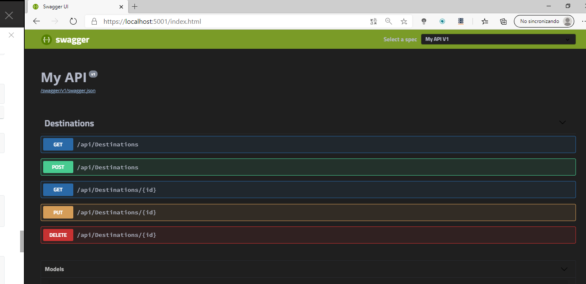
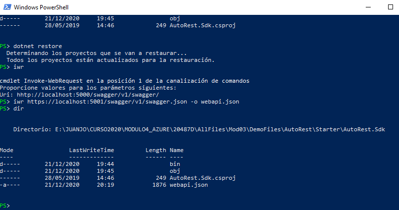
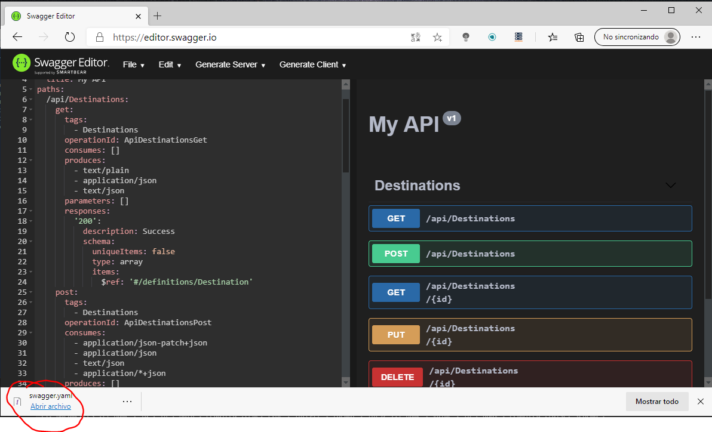
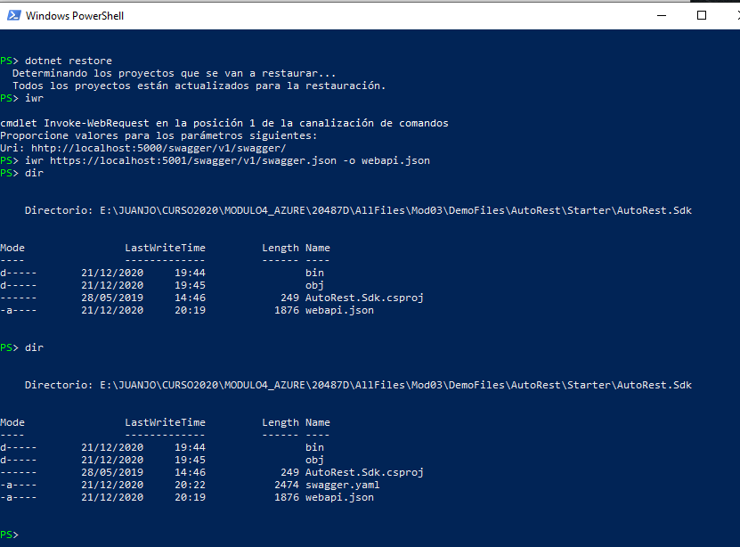
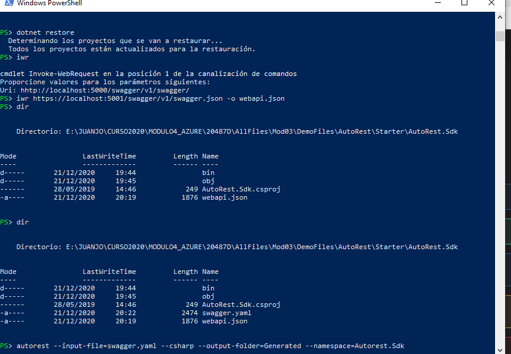
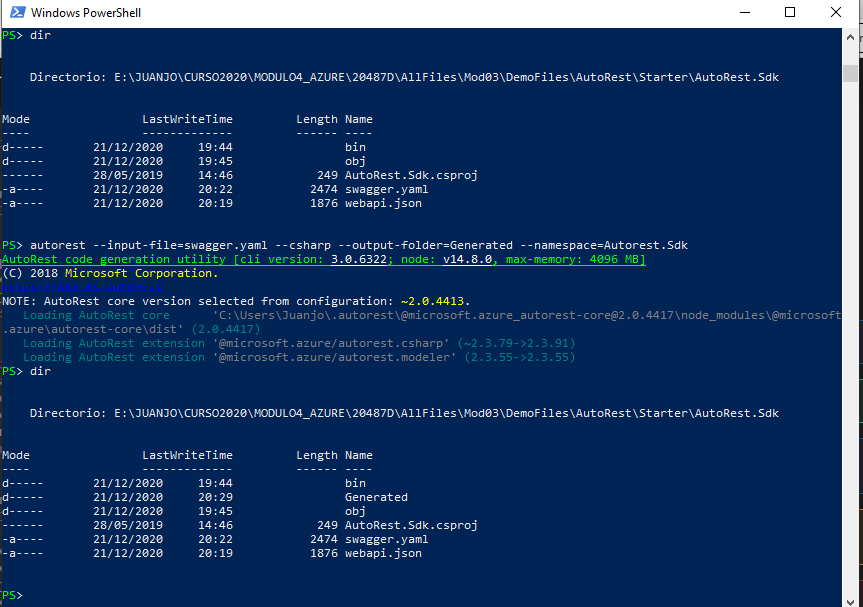
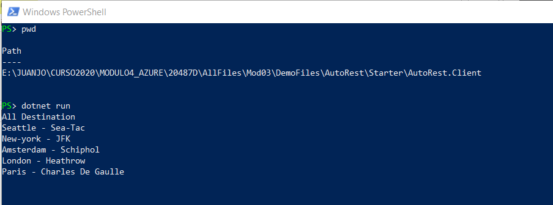
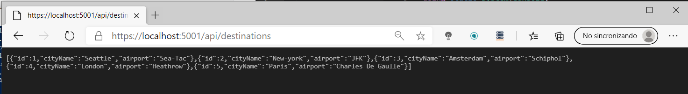

Vamos a poder convertir json a xmal y éste dice a Autorest como debe generar el código c#

y así poder llamar a las Web Api

Comprobamos que funciona nuestro web api

Creamos el json:

A partir de ese webapi.json creamos el xmal

Copiamos en el xmal generado en el directorio Autorest.Sdk

Comando para geneal el CSharp a partir del xmal

Se ha generado el Csharp:

Se llama al recurso Get:

Que es lo mismo que por web:

El proyecto resultante se encuentra en la carpeta AutoRest.Sdk
