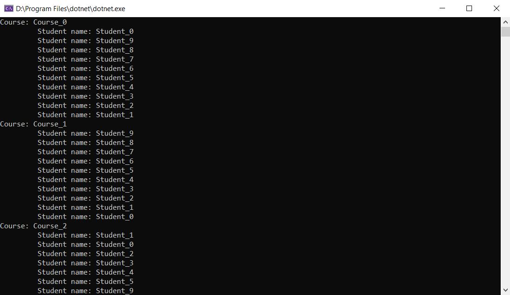

# Querying-Data
DEMO2_L3_1

Tenemos una bbdd de estudiantes y cursos y lo que hacemos es traernos con un LINQ los cursos del contexto 

<pre><code>
 var courses = from c in context.Courses
               select c;
</code></pre>            

 Luego los mostramos los estudiantes de cada curso:

 <pre><code>
 foreach (var course in courses)
 {
     Console.WriteLine($"Course: {course.Name}");
     foreach (var student in course.Students)
     {
         Console.WriteLine($"\t Student name: {student.Name}");
     }
 }
 Console.ReadLine();
 </code></pre> 

